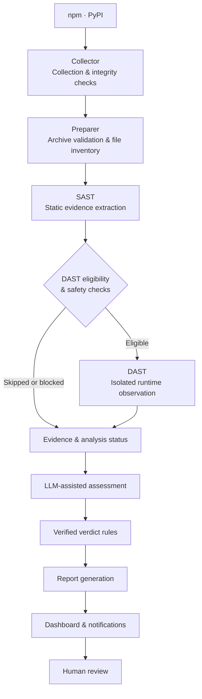

  

  

Evidence-driven malicious package detection for the open-source ecosystem.

smiling-hyena is a security research team building a malicious package detection pipeline for npm and PyPI.

We combine static analysis, isolated runtime observation, and LLM-assisted assessment to investigate suspicious packages and produce traceable findings. Our work connects automated detection with human review, helping researchers understand what a package does and why it deserves attention.

## What We Do

We collect package releases, investigate potentially harmful behavior, and turn analysis evidence into actionable reports.

### Why smiling-hyena?

- **Understand behavior in context:** Assess what a package is likely doing and how that relates to its stated purpose. Combining complementary evidence helps reviewers interpret suspicious activity, with the goal of faster assessment and fewer false positives from isolated indicators.
- **Verify the reasoning:** Follow each verdict back to its supporting code and runtime observations, and understand why the assessment changed before accepting a finding.
- **Recognize the limits:** See what was analyzed, what was skipped, and where evidence is incomplete, so missing observations are not mistaken for proof of safety.
- **Investigate with isolation:** Examine potentially harmful behavior in a dedicated execution environment, with controls that limit exposure of the analysis system.
- **Move from discovery to review:** Follow collected packages through analysis, reporting, and human review in one workflow, and use documented findings to prepare disclosures.
- **Build on reviewed findings:** Use confirmed cases and false-positive reviews to guide improvements to detection rules and verdict policies.

### Detection & Contributions

We investigate suspicious packages and document the evidence behind each confirmed finding. Our contributions include technical analysis, detection improvements, and reports submitted to the OpenSSF malicious-packages database.

#### Analysis & Confirmed Findings

- [View analysis results](https://hyena-dashboard-314003657440.asia-northeast3.run.app/#/overview?period=all&eco=all&date_basis=created)

The dashboard provides continuously updated analysis results from operations beginning on 2026-09-14. Automated verdicts and human review outcomes are shown separately; an automated verdict alone does not indicate a confirmed finding.

Counting basis: unique package–version pairs  
Confirmed malicious packages are those verified as malicious through human review.

The report repository distinguishes `malicious` findings from `pentest` cases. The latter include security tests, proofs of concept, and CTF probes that collect data or execute code beyond expected behavior but appear to serve a testing purpose. The dashboard manages these cases together rather than maintaining separate totals for the two repository categories. Consult individual reports for classification and review details.

#### Public Research Data

Our [report repository](https://github.com/smiling-hyena/malicious-package-reports) provides OSV JSON reports with reviewed versions, behavior descriptions, code locations, and indicators. Cases that share infrastructure or code are grouped in `campaigns/` and referenced through `database_specific.campaign`, supporting further research and comparison across related packages.

Each report published in the report repository is reviewed and confirmed by a person before it is added; an automated verdict alone is not sufficient for publication there. The repository contains descriptions and indicators, not the reported packages' code. If a report appears incorrect, see [Contact & Corrections](#contact--corrections).

#### Discoveries & Contributions

The following OSV records document packages we identified and contributed findings on, including cases with multiple credited researchers.

| Package | OSV ID |
|---|---|
| npm/jexkcode | [MAL-2026-16220](https://osv.dev/vulnerability/MAL-2026-16220) |
| npm/radio-player-theme | [MAL-2026-16347](https://osv.dev/vulnerability/MAL-2026-16347) |
| PyPI/my-private-pkg | [MAL-2026-17180](https://osv.dev/vulnerability/MAL-2026-17180) |
| npm/cat-sis2go-utils | [MAL-2026-16071](https://osv.dev/vulnerability/MAL-2026-16071) |
| npm/godsplan | [MAL-2026-17315](https://osv.dev/vulnerability/MAL-2026-17315) |
| npm/@zeronexcode/baileys | [MAL-2026-17326](https://osv.dev/vulnerability/MAL-2026-17326) |
| PyPI/friendly-greeting-tools | [MAL-2026-17416](https://osv.dev/vulnerability/MAL-2026-17416) |

>*Detailed case reports include detection timestamps, supporting evidence, and disclosure status. Previously reported malware and newly identified cases are distinguished.*

## Pipeline & Technical Features

### Analysis Pipeline

### Technical Features

**Collector & Preparer**

Collect registry metadata and package artifacts, validate hashes and sizes, check archive entries, and produce an inventory of extracted files without executing package code.

**SAST**

Inspect npm installation hooks and JavaScript entry points, and analyze PyPI build settings, Python syntax trees, and call relationships. Emit signals with file locations, code excerpts, and execution context.

**DAST**

Check runtime attestation, eligibility, and safety conditions before execution in a dedicated Docker and gVisor sandbox. Collect process, filesystem, environment, and network observations under controlled networking.

**LLM assessment**

Construct `LlmInput` from package metadata and SAST/DAST signal bundles, including incomplete or unavailable DAST states. The model returns a verdict, rationale, and cited signal IDs; validate the response format and citation IDs.

**Verdict validation**

Apply rules that check evidence connections, execution context, and observation scope. Record rule IDs, policy versions, and reasons for retaining or adjusting the original verdict.

**Reporter & review storage**

Store original and final verdicts, signal references, errors, limitations, and stage timings in `AnalysisReport`. Store human review results and change history separately in the database.

**Shared contracts & orchestration**

Exchange versioned data contracts between modules. Workers process `FETCH` and `PREPARE` jobs, while the orchestrator sequences preparation, SAST, DAST, assessment, validation, and reporting.

## Documentation & Wiki

Explore the implementation, evaluation methods, and research behind smiling-hyena.

- [Getting Started](https://github.com/smiling-hyena/demo-repository) — Prerequisites, configuration, and your first analysis
- [Evaluation](논문 링크?) — Datasets, detection metrics, detection latency, and limitations
- [Project Wiki](https://hyena-dashboard-314003657440.asia-northeast3.run.app/#/pipeline) — Research notes, design decisions, and development documentation

## Team

We bring together package ecosystem research, malware analysis, and security engineering to build and improve smiling-hyena.

- [@ben-dh-kim](https://github.com/ben-dh-kim)
- [@eyalyal](https://github.com/eyalyal)
- [@0xAxii](https://github.com/0xAxii)
- [@Juhyeok0603](https://github.com/Juhyeok0603)
- [@justkorean1681](https://github.com/justkorean1681)
- [@OGAREE](https://github.com/OGAREE)
- [@ragon5500-arch](https://github.com/ragon5500-arch)
- [@Ridhdn](https://github.com/Ridhdn)
- [@saic12](https://github.com/saic12)
- [@WOVY](https://github.com/WOVY)

## Contact & Corrections

For questions or corrections, email [smilinghyena4@gmail.com](mailto:smilinghyena4@gmail.com) or [open an issue in the report repository](https://github.com/smiling-hyena/malicious-package-reports/issues). Include the package name, version, and the finding you believe is incorrect.

We review the code again and, if a report is wrong, move it to `withdrawn/` with an explanation, preserving the correction history. Reports are exported from review records, so please use an issue or email rather than a pull request that edits a report directly. 

## Disclaimer

Reports are published as they are, without warranty. Each one reflects a manual review of the code at the version listed; other versions were not checked unless they are listed too. Mistakes are possible, which is why the process above exists.

## License
The reports and campaign files are licensed under [CC BY 4.0](https://creativecommons.org/licenses/by/4.0/): you may use them for any purpose as long as you credit smiling-hyena as the source.

