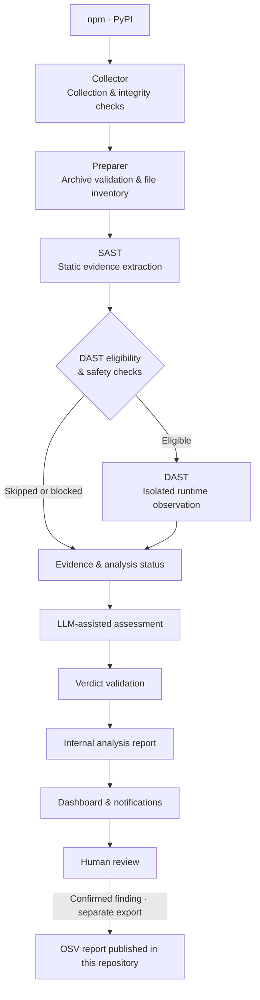

  

Evidence-driven malicious package detection for the open-source ecosystem.

smiling-hyena is a security research team building a malicious package detection pipeline for npm and PyPI.

The pipeline combines static analysis with sandboxed runtime testing and LLM-assisted analysis. Reviewers then verify the results using the package code and the evidence collected during analysis.

## Why smiling-hyena?

We use static and dynamic analysis together because either one can miss important context on its own.

An LLM helps interpret the collected evidence, but the final confirmation is done by a reviewer.

By combining these analyses, we aim to detect malicious packages accurately and quickly.

## Detection & Contributions

We write up confirmed findings and submit the reports to the OpenSSF malicious-packages database.

### Analysis & Confirmed Findings

- [View analysis results](https://hyena-dashboard-314003657440.asia-northeast3.run.app/#/overview?period=all&eco=all&date_basis=created)

The dashboard shows analysis results collected since 2026-09-14. It displays automated verdicts separately from human review results. A finding is considered confirmed only after human review.

Counting basis: unique package–version pairs  

The report repository distinguishes `malicious` findings from `pentest` cases. The latter include security tests, proofs of concept, and CTF probes that collect data or execute code beyond expected behavior but appear to serve a testing purpose. The dashboard manages these cases together rather than maintaining separate totals for the two repository categories. Consult individual reports for classification and review details.

### Public Research Data

Our [report repository](https://github.com/smiling-hyena/malicious-package-reports) provides OSV JSON reports with reviewed versions, behavior descriptions, code locations, and indicators. Cases that share infrastructure or code are grouped in `campaigns/` and referenced through `database_specific.campaign`.

Only human-reviewed findings are published in the report repository. The repository contains descriptions and indicators, not the reported packages' code. If a report appears incorrect, see [Contact & Corrections](#contact--corrections).

### Reported Findings

The following OSV records include packages we identified or investigated and reported to OpenSSF. Some records also credit other researchers.

| Package | OSV ID |
|---|---|
| npm/jexkcode | [MAL-2026-16220](https://osv.dev/vulnerability/MAL-2026-16220) |
| npm/radio-player-theme | [MAL-2026-16347](https://osv.dev/vulnerability/MAL-2026-16347) |
| PyPI/my-private-pkg | [MAL-2026-17180](https://osv.dev/vulnerability/MAL-2026-17180) |
| npm/cat-sis2go-utils | [MAL-2026-16071](https://osv.dev/vulnerability/MAL-2026-16071) |
| npm/godsplan | [MAL-2026-17315](https://osv.dev/vulnerability/MAL-2026-17315) |
| npm/@zeronexcode/baileys | [MAL-2026-17326](https://osv.dev/vulnerability/MAL-2026-17326) |
| PyPI/friendly-greeting-tools | [MAL-2026-17416](https://osv.dev/vulnerability/MAL-2026-17416) |

## Pipeline & Technical Features

### Analysis Pipeline

### Technical Features

#### Collector & Preparer

The collector monitors npm and PyPI for new or updated package releases. It records registry metadata and downloads package artifacts with integrity and size checks.

The preparer validates each downloaded artifact before extraction. It checks archive entries and creates a file inventory for later analysis stages. Neither stage executes package code.

#### Static Analysis

Static analysis examines code and configuration that may affect package installation or execution.

For npm packages it checks lifecycle scripts, JavaScript entry points and package metadata. For PyPI packages it inspects build configuration, Python source code and entry points.

The analysis looks for behavior such as command execution, network access and credential-related code. It also detects dynamically constructed behavior. Each finding includes the relevant code location and information about how the code may be triggered.

#### Dynamic Analysis

Eligible packages are executed in Docker containers isolated with gVisor. This helps reveal behavior that may be difficult to confirm through static analysis alone.

Before execution the pipeline checks runtime attestation and package eligibility. It also verifies that the required isolation and safety conditions are in place.

Runtime analysis records process execution, filesystem activity and network behavior. It also tracks access to environment data. If an analysis is skipped, blocked or incomplete, that status is kept with the observations that were collected.

#### LLM-assisted Analysis

The LLM receives package metadata together with normalized findings from static and dynamic analysis. It can also receive code excerpts linked to individual signals and information about limits on runtime observation.

The model returns an initial assessment with its reasoning and the signal IDs it relied on. The pipeline then checks the response format and verifies that the referenced IDs exist.

The initial assessment and its supporting evidence are stored in the internal analysis report.

#### Verdict Validation

After the model produces an initial verdict, validation rules check whether the evidence supports it. The rules consider execution context and the scope of the observations to determine whether to keep or adjust the verdict.

The internal report records the rule identifiers and policy versions used during validation as well as any resulting changes.

The validated result becomes the final automated verdict. If the available evidence is not strong enough, the result may remain suspicious or be marked as insufficient evidence.

#### Reporter & Review Storage

`AnalysisReport` stores the original verdict and the final automated verdict. It also keeps signal references, errors, limitations and stage timings.

Human review results and review history are stored separately in the database.

#### Shared Contracts & Orchestration

Modules exchange data through versioned contracts.

Workers handle `FETCH` and `PREPARE` jobs. The orchestrator then runs preparation, SAST, DAST, assessment, validation and reporting in sequence.

## Documentation & Wiki

- [Getting Started](https://github.com/smiling-hyena/demo-repository) — Prerequisites, configuration, and your first analysis
- [Project Wiki](https://hyena-dashboard-314003657440.asia-northeast3.run.app/#/pipeline) — Research notes, design decisions, and development documentation

## Team

- [@ben-dh-kim](https://github.com/ben-dh-kim)
- [@eyalyal](https://github.com/eyalyal)
- [@0xAxii](https://github.com/0xAxii)
- [@Juhyeok0603](https://github.com/Juhyeok0603)
- [@justkorean1681](https://github.com/justkorean1681)
- [@OGAREE](https://github.com/OGAREE)
- [@ragon5500-arch](https://github.com/ragon5500-arch)
- [@Ridhdn](https://github.com/Ridhdn)
- [@saic12](https://github.com/saic12)
- [@WOVY](https://github.com/WOVY)

## Contact & Corrections

For questions or corrections, email [smilinghyena4@gmail.com](mailto:smilinghyena4@gmail.com) or [open an issue in the report repository](https://github.com/smiling-hyena/malicious-package-reports/issues). Include the package name, version, and the finding you believe is incorrect.

We review the relevant package version and supporting evidence again. If a report is incorrect, we move it to `withdrawn/` with an explanation, preserving the correction history. Reports are exported from review records, so please use an issue or email rather than a pull request that edits a report directly.

## Disclaimer

Reports are provided as-is, without warranty. Each report reflects a manual review of the code and supporting evidence for the package versions listed. Versions that are not listed should not be assumed to have been reviewed. Errors can be reported through the correction process above.

## License

The reports and campaign files are licensed under [CC BY 4.0](https://creativecommons.org/licenses/by/4.0/): you may use them for any purpose as long as you credit smiling-hyena as the source.

